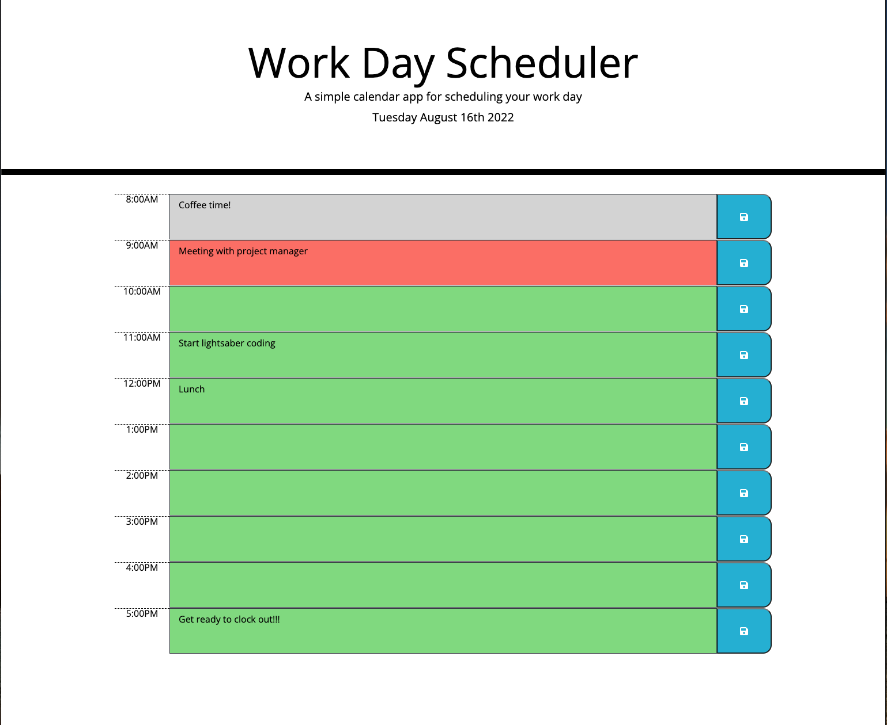

# Work Day Scheduler
## Description 
Work day scheduler is a daily planner for business hours to help users to track their events.

- Users are able to add, edit, or delete their events inside hour bar.

- Each time block has color-coded. Green = future, red = present, and grey = past.

- Scheduler has capable to storage the events to localStorage after click the save button. 

## Screenshot

## GitHub Page link
Click [here](https://jlara65.github.io/work-day-scheduler/) to start your work day without diaster.